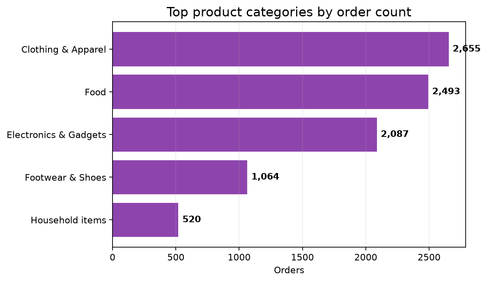

# Diwali Sales Analysis — Python EDA Case Study

A Python and Pandas exploratory analysis of customer purchases during a Diwali sales period. The project examines customer demographics, geography, occupation, marital status, and product-category demand to turn a transaction extract into practical retail questions.

> **Portfolio focus:** data cleaning, customer segmentation, regional analysis, category performance, visualization, and decision-oriented interpretation.

## Business objective

A retail team needs to understand which customer groups and regions contribute most to sales and which product categories deserve attention during a seasonal campaign. This analysis provides a descriptive view of demand while documenting the cleaning assumptions used in the notebook.

## Verified dataset facts

The raw CSV contains **11,251 rows**, 15 columns, 8 duplicate rows, and 22,514 empty cells [1]. After removing the unused `Status` and `unnamed1` columns, dropping incomplete rows, and converting `Amount` to integer, the analysis-ready extract contains **11,239 rows** and total amount of **₹106,249,129** [2].

| Metric | Verified result |
|---|---:|
| Raw rows | 11,251 |
| Raw duplicate rows | 8 |
| Raw empty cells | 22,514 |
| Clean rows | 11,239 |
| Clean amount | ₹106,249,129 |
| Top state by amount | Uttar Pradesh |
| Top category by amount | Food |
| Most common occupation by rows | IT Sector |

## Visual evidence



The chart summarizes category performance from the cleaned analysis extract. It is generated from the same CSV used by the notebook and is intended to make the main result visible without requiring a reviewer to open Jupyter.

## Key business insights

Uttar Pradesh is the leading state by observed amount in the cleaned extract, Food is the leading product category by amount, and IT Sector is the most common occupation by row count. These findings can guide follow-up questions about campaign targeting, regional inventory, and category merchandising.

The cleaning step removes 12 rows from the raw file after excluding incomplete records. This improves consistency for aggregation but may introduce selection bias if missingness is systematic. A production analysis should report missingness by field, preserve a rejected-records log, and test whether excluded customers differ from retained customers.

## Analytical workflow

The notebook imports the CSV, profiles missing values and duplicates, drops the unused columns, removes incomplete rows, converts `Amount` to integer, and explores sales by gender, age group, state, marital status, occupation, and product category. The chart asset is generated from the same cleaned logic.

## Data-quality checks

The validation script checks the expected columns, raw row count, duplicate count, missing-cell count, clean-row count, numeric amount conversion, non-negative amounts, and the presence of key dimensions used in the analysis.

## Repository structure

```text
├── Diwali_Sales_Analysis.ipynb
├── Diwali_Sales_Data.csv
├── images/
│   └── diwali_top_categories.png
├── requirements.txt
└── scripts/
    └── validate_data.py
```

## How to reproduce

```bash
git clone https://github.com/Corvus06655/diwali-sales-analysis.git
cd diwali-sales-analysis
python -m venv .venv
# Windows: .venv\Scripts\activate
# macOS/Linux: source .venv/bin/activate
pip install -r requirements.txt
python scripts/validate_data.py
```

Then open `Diwali_Sales_Analysis.ipynb` in Jupyter and run the notebook cells from top to bottom.

## Data provenance and limitations

The repository contains the CSV used for this educational seasonal-sales case study. The dataset is not a live retail reporting system, and the findings should not be interpreted as current business performance. Amounts are reported in the dataset’s currency convention and should be reconciled with a data dictionary before operational use.

## References

[1]: Diwali_Sales_Data.csv — raw seasonal-sales extract.
[2]: Diwali_Sales_Analysis.ipynb — cleaning and exploratory analysis workflow.
[3]: images/diwali_top_categories.png — category visualization generated from the project data.

## Author

**Mayank Srivastava** · [GitHub](https://github.com/Corvus06655) · [LinkedIn](https://linkedin.com/in/mayank-srivastava-076020215)
